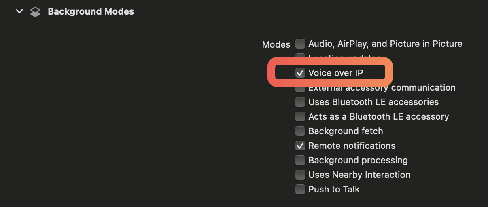

OneSignal does allow sending VoIP notifications for Android and iOS. However, our SDK does not support registration of a VoIP token at this time. This guide will share exact steps you need to take to get setup.
# Android VoIP Setup

Android does not have the concept of "VoIP Push" the same as iOS. Notifications will just work, including data-only messages where you can start an Activity instead of showing a push.
If you need to call custom class for showing native UI, for example, you would use the Android `NotificationExtenderService` so you can override the notification and show your custom UI or start your custom Activity.
Visit our [Service Extensions](https://documentation.onesignal.com/docs/service-extensions#notification-extender-service) docs for more on setting up the `NotificationExtenderService`.
Also, see [Android's documentation for setting up a calling app](https://developer.android.com/guide/topics/connectivity/telecom/selfManaged) and this Medium post by Lloyd Dcosta to [Show incoming voip call notification and open activity for android OS>10](https://medium.com/@dcostalloyd90/show-incoming-voip-call-notification-and-open-activity-for-android-os-10-5aada2d4c1e4).

---
# iOS VoIP Setup
> [!important]
>  You must have TWO OneSignal Apps to use VoIP and Push. Your app that handles Push is the ONLY app id that should be used in the SDK. VoIP Users must be created manually using the API. If a VoIP user interacts with our SDK, they will get a push token automatically and there will be no VoIP token available to use for them. 
## Go to your Organization Page and create a new app for VoIP


## For your configuration, you will need to use a p12 certificate with VoIP capabilities added to it
> [!Note]
> Follow the steps on generating a p12 by requesting from a certificate authority and saving the file that you will upload to your Apple Developer Dashboard and then return here for next steps. 

Once you have a Certificate Signing Request saved, you can go to your Apple Developer Dashboard and open the Certificates page to generate a new Certificate. 

You'll choose the VoIP option and then proceed as you would generating any other p12 certificate:


## Open the .cer file you've just downloaded in Keychain Access 
Make sure that you're under "login" on the left and My Certificates on the tool bar at the top and then select the VoIP Services certificate:


Right Click this row and select "Export":


Save the P12 and now you can upload this to your OneSignal dashboard

---
# XCode Set Up
## Make sure you've added VoIP as a capability

## Ensure you're importing the correct dependencies
```swift
import CallKit
import PushKit
```

## Add the appropriate protocol to your class
```swift
//Add the PKPushRegistryDelegate protocol
class AppDelegate: UIResponder, UIApplicationDelegate, PKPushRegistryDelegate{
```
## Generate a VoIP Token
```swift
    let callController = CXCallController()

    func pushRegistry(_ registry: PKPushRegistry, didUpdate pushCredentials: PKPushCredentials, for type: PKPushType) {
        print("=================== VOIP ======================")
        let tokenData = pushCredentials.token
        let tokenString = tokenData.map { String(format: "%02x", $0) }.joined()
        print("VoIP Push Token: \(tokenString)")

    }
```

## Perform some action when VoIP is received
```swift
    func pushRegistry(_ registry: PKPushRegistry, didReceiveIncomingPushWith payload: PKPushPayload, for type: PKPushType) {
        print("==================== VOIP RECEIVED ====================")
    }
```

## Call the functions in your App Delegate
```swift
        let voipRegistry = PKPushRegistry(queue: DispatchQueue.main)
	        voipRegistry.delegate = **self**
	        voipRegistry.desiredPushTypes = [.voIP]
```

## Running the app should provide the VoIP token:


# Creating a VoIP User
## Generate a new user, using the token we logged out above
- This can be done using [Create User](https://documentation.onesignal.com/reference/create-user) Endpoint
- Since we don't officially support VoIP, the type for the user should be "iOSPush"
- The `"test_type" : 1` should be used when testing on an XCode, or development, build. Omit this on Production APNS environments.
```shell
curl --location 'https://onesignal.com/api/v1/apps/APP_ID/users' \
--header 'Authorization: Basic API_KEY' \
--header 'Content-Type: application/json' \
--data '{
	"identity": {
		"external_id": "voip123"
	},
	"subscriptions": [{
		"type": "iOSPush",
		"token": "8036736ff8e03017d9e307ecabc5eb23375635385454efaf68eda67e692cf16ee20d5d5f91ca5844553e3fec98e8dfe50e4cefefc92af16af2db1d0f4ccee48c95547c22f1658920d4de8724527bdbe6",
		"test_type": 1
	}]
}'
```

---
# Sending a test VoIP message
When sending a voip message, we are changing a parameter in the request made to Apple's servers. This change only takes place if you specify that the message you're sending is intended to be sent as "voip" using the "apns_push_type_override" parameter:
```shell
On branch master
Your branch is ahead of 'origin/master' by 1 commit.
  (use "git push" to publish your local commits)

nothing to commit, working tree clean
--header 'Authorization: Basic API_KEY' \
--header 'Content-Type: application/json' \
--header 'Cookie: __cf_bm=CRiGUCcTeeTC89JSRTQ2Eu1bMQkfFVhSsOOLQ_Ru5gQ-1724425347-1.0.1.1-Ny4.U25nAvtSJfK2Bg0FvD7Fsm5J47UcIVAxdQWFr6EP3FadyzqZS_e_XUNz7RMhHFjivAUDDugu5QeExXu5MA' \
--data '{
    "app_id": "APP_ID",
    "include_subscription_ids": [
        "50423dba-566d-4391-b3ae-4b5653abf27e"
    ],
    "apns_push_type_override": "voip",
    "contents": {
        "en": "English Message"
    }
}'

```

## Check the logs to see if the VoIP message was received:


---
# Troubleshooting

## Most Common Issues can be solved by ensuring the following:
1. You have a dedicated OneSignal App only used for VoIP. You **cannot** mix SDK users and VoIP users on the same OneSignal app because the certificates have different capabilities and p8 keys cannot be used for VoIP.
2. You are not using your VoIP App ID inside of the SDK (`OneSignal.Initialize("your_push_app_id_only")`). Our SDK automatically creates push tokens so if you use the voip app id, it will create a push token and overwrite the voip token you added to that device.

## APNS Bad Device Token or `invalid_player_ids`
If you encounter this, there could be a mismatch between the test type of the device and the environment we are trying to send the notification to. Delete the user from your dashboard, and recreate them changing the `test_type` value for that user to 1 if building from XCode or 0 if building on a production environment/testflight build. Ensure that the subscription record has a check mark ✅ under the "Subscription Status" column and then try sending the message again. 


## Message sent but VoIP was not received
Make sure that you are including the required information into your HTTP request when creating the message. The mandatory fields are:
- App ID - This must be the App ID that corresponds with your VoIP OneSignal App
- Audience - The target of the message has valid users that can receive the message. The available parameters can be found [here](https://documentation.onesignal.com/reference/notification-parameters#targeting)
- apns_push_type_override: voip - This **must** be included in your HTTP request or the message will be sent as a push, and since the token of the user is for VoIP, it will succeed in sending but will not be delivered because the token will not match

---

# FAQ

## Do [Confirmed Deliveries](doc:confirmed-deliveries) work with VOIP?
Since VoIP notifications work much differently than regular push, [Confirmed Deliveries](doc:confirmed-deliveries) will not be tracked for them. Confirmed Deliveries requires the Notification Service Extension, which may not start with VoIP.
The recommended option is to set up the iOS VoIP event: `pushRegistry(_:didReceiveIncomingPushWith:for:completion:)` which is simpler as it is part of your main app target instead of having to bridge to the
Notification Service Extension.

More details on this event in [Apple's VoIP docs](https://developer.apple.com/documentation/pushkit/responding_to_voip_notifications_from_pushkit#3377587).
